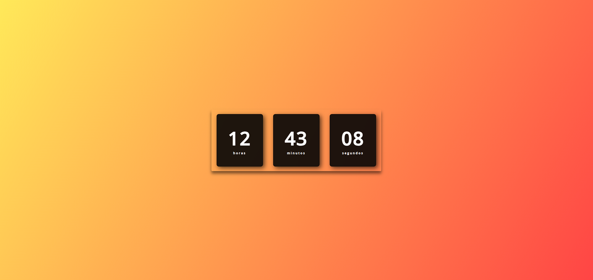

<h1 align="center"> Relogio Digital </h1>

Desenvolvido em estudo de tecnologias WEB.  

  <a href="#-tecnologias">Tecnologias</a>&nbsp;&nbsp;&nbsp;|&nbsp;&nbsp;&nbsp;
  <a href="#-projeto">Projeto</a>&nbsp;&nbsp;&nbsp;|&nbsp;&nbsp;&nbsp;
  <a href="#-layout">Layout</a>&nbsp;&nbsp;&nbsp;|&nbsp;&nbsp;&nbsp;
  <a href="#memo-licença">Licença</a>

  

 

  

## 🚀 Tecnologias

Esse projeto foi desenvolvido com as seguintes tecnologias:

- HTML e CSS
- JavaScript
- Git e Github

## 💻 Projeto

Relogio Digital online.

## 🔖 Layout

Você pode visualizar o layout do projeto através [DESSE LINK](https://www.youtube.com/watch?v=GK0ok3ZCXwM&t=160s).Não  É necessário ter conta no [youtube](https://youtube.com) para acessá-lo.

## :memo: Licença

Esse projeto está sob a licença MIT.

---

Feito com ♥ by Rodrigo Lucca :wave: